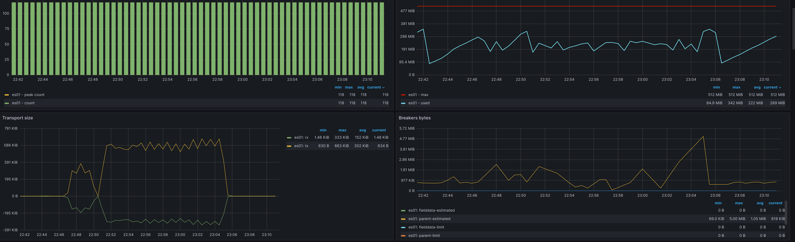
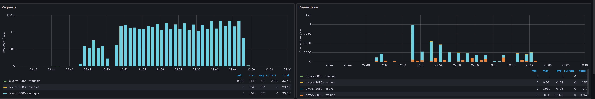

# projector-monitoring
Homework 1.3 for Projector Highload Software Architecture course
 
Configs are taken from https://github.com/bcremer/docker-telegraf-influx-grafana-stack
 
Plugin for docker is taken from https://github.com/influxdata/telegraf/blob/master/plugins/inputs/docker/README.md

# How to run the app
1. Copy ./backend/.env.example into ./backend/.env
2. docker-compose up

# Which services are here
1. Telegraf to collect metrics and put them to InfluxDB
2. InfluxDB to store metrics data from Telegraf
3. Grafana to visualize metrics on the dashboards
4. Node.js application (using Nest.js framework) that has:
    * POST /messages endpoint to post a message with any text and store it to MongoDb and ElasticSearch
    * GET /messages/search?search="" to search for a specific message relying on ElasticSearch
    * users model and CRUD
    * message CRUD
5. MongoDB to store the data from the backend
6. ElasticSearch cluster (3 nodes) to store the data and search in text
7. Nginx as a gateway for the backend

# Tests
## Post 100.000 requests with 10 concurrency
`ab -n 100000 -c 10 -p ../ab/create-message.json -T application/json http://localhost:8080/messages`
This is ApacheBench, Version 2.3 <$Revision: 1903618 $>
Copyright 1996 Adam Twiss, Zeus Technology Ltd, http://www.zeustech.net/
Licensed to The Apache Software Foundation, http://www.apache.org/

Benchmarking localhost (be patient)
Completed 10000 requests
Completed 20000 requests
Completed 30000 requests
Completed 40000 requests
Completed 50000 requests
Completed 60000 requests
Completed 70000 requests
Completed 80000 requests
Completed 90000 requests
Completed 100000 requests
Finished 100000 requests

Server Software:        nginx/1.27.0
Server Hostname:        localhost
Server Port:            8080

Document Path:          /messages
Document Length:        211 bytes

Concurrency Level:      10
Time taken for tests:   154.772 seconds
Complete requests:      100000
Failed requests:        0
Total transferred:      44600000 bytes
Total body sent:        25600000
HTML transferred:       21100000 bytes
Requests per second:    646.11 [#/sec] (mean)
Time per request:       15.477 [ms] (mean)
Time per request:       1.548 [ms] (mean, across all concurrent requests)
Transfer rate:          281.41 [Kbytes/sec] received
                        161.53 kb/s sent
                        442.94 kb/s total

Connection Times (ms)
              min  mean[+/-sd] median   max
Connect:        0    0   0.0      0       1
Processing:     3   15   7.4     16     578
Waiting:        3   15   7.3     16     578
Total:          3   15   7.4     16     578

Percentage of the requests served within a certain time (ms)
  50%     16
  66%     18
  75%     19
  80%     20
  90%     22
  95%     24
  98%     26
  99%     28
 100%    578 (longest request)

## Post 1.000.000 requests with 50 concurrency
`ab -n 1000000 -c 50 -p ../ab/create-message.json -T application/json http://localhost:8080/messages`
This is ApacheBench, Version 2.3 <$Revision: 1903618 $>
Copyright 1996 Adam Twiss, Zeus Technology Ltd, http://www.zeustech.net/
Licensed to The Apache Software Foundation, http://www.apache.org/

Benchmarking localhost (be patient)
Completed 100000 requests
Completed 200000 requests
Completed 300000 requests
Completed 400000 requests
Completed 500000 requests
Completed 600000 requests
Completed 700000 requests
Completed 800000 requests
Completed 900000 requests
Completed 1000000 requests
Finished 1000000 requests

Server Software:        nginx/1.27.0
Server Hostname:        localhost
Server Port:            8080

Document Path:          /messages
Document Length:        211 bytes

Concurrency Level:      50
Time taken for tests:   844.341 seconds
Complete requests:      1000000
Failed requests:        0
Total transferred:      446000000 bytes
Total body sent:        256000000
HTML transferred:       211000000 bytes
Requests per second:    1184.36 [#/sec] (mean)
Time per request:       42.217 [ms] (mean)
Time per request:       0.844 [ms] (mean, across all concurrent requests)
Transfer rate:          515.84 [Kbytes/sec] received
                        296.09 kb/s sent
                        811.93 kb/s total

Connection Times (ms)
              min  mean[+/-sd] median   max
Connect:        0    0   0.0      0       2
Processing:    12   42  10.6     43     182
Waiting:       12   42  10.6     43     182
Total:         12   42  10.6     43     182

Percentage of the requests served within a certain time (ms)
  50%     43
  66%     45
  75%     47
  80%     48
  90%     53
  95%     59
  98%     69
  99%     77
 100%    182 (longest request)

# Metrics comparison with and w/o load
You can find a better resolution screens in `./results` folder.
 
The first pick is after 100.000 request. The next wave is 1.000.000 requests with bigger concurrency

## Docker

## Elastic

## Mongo

## Nginx

## System

